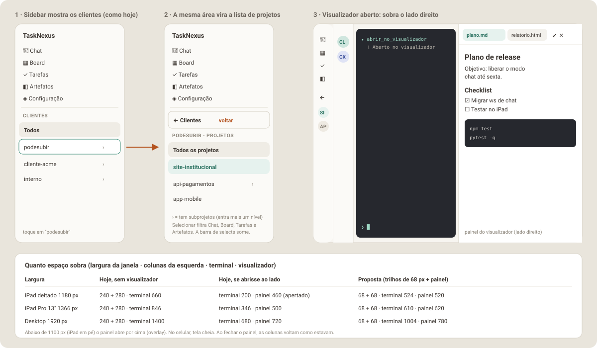

# Parte 8 — Planejamento da Fase N: cliente → projeto na sidebar e espaço para o visualizador

> **O pedido:** liberar espaço no desktop e no tablet. Ao selecionar um
> cliente, **a própria lista de clientes vira a lista de projetos** desse
> cliente, com uma seta ou botão para **voltar à lista de clientes**. Com isso
> sobra espaço no **lado direito** para abrir o visualizador de arquivos
> (o "dropdown" da Fase V).
>
> É uma mudança pequena e localizada **em cima do layout v2 atual**: a
> sidebar continua onde está, com a mesma largura e o mesmo visual. Muda o
> **conteúdo** da seção de clientes e o que acontece com as colunas quando o
> visualizador abre.



---

## 8.1 Situação atual (medida no código)

| Coluna | Componente | Largura | O que tem |
|--------|-----------|---------|-----------|
| Sidebar | `SidebarV2.jsx` + `ClienteList.jsx` | 240 px (68 px recolhida) | menu (Chat, Board, Tarefas, Configuração) + "Clientes" (Todos + clientes) |
| Lista de chats | `ChatSidebarV2.jsx` + `ChatList.jsx` | 280 px (68 px recolhida) | conversas do cliente selecionado |
| Conteúdo | `ChatV2.jsx` (terminal), `BoardV2`, `TarefasV2`… | o resto | no Board e em Tarefas há ainda uma **barra de selects** Cliente/Projeto (`ClienteProjetoFilterBar`) |

Problemas:

1. **Projeto não tem lugar na navegação.** Só existe como select na barra
   do Board/Tarefas, que come uma faixa de ~45 px de altura, e o Chat não
   filtra por projeto (mostra "Raiz" ou o subprojeto em cada linha).
2. **Não há espaço para um painel à direita.** Num iPad deitado (1180 px),
   240 + 280 px deixam 660 px para o terminal. Abrir um visualizador ao lado
   deixaria ~200 px de terminal.

---

## 8.2 A proposta

### 8.2.1 Cliente → projeto na mesma área (drill-down)

1. **Nível Clientes** (como hoje): "Todos" + clientes. Clientes que têm
   subprojetos mostram **›** à direita.
2. Tocar num cliente **com** subprojetos: a seção inteira troca para o
   **nível Projetos** daquele cliente, com animação curta de deslizar
   (respeita `prefers-reduced-motion`). Tocar num cliente **sem** subprojetos
   só o seleciona, como hoje.
3. **Nível Projetos:**
   - botão **← Clientes** no topo (altura 44 px, largura toda);
   - rótulo `PODESUBIR · PROJETOS`;
   - **Todos os projetos** (= cliente inteiro, igual a selecionar o cliente hoje);
   - **Raiz** (só se a pasta do cliente for elegível para chat, `elegivel: true`);
   - os projetos filhos diretos, em ordem alfabética; os que têm filhos
     mostram **›** e entram mais um nível (o botão de voltar vira
     **← api-pagamentos**, o pai).
4. Selecionar um projeto **filtra todas as telas**: lista de chats, Board,
   Tarefas e Artefatos. A **barra de selects** (`ClienteProjetoFilterBar`)
   deixa de ser necessária e sai do Board e de Tarefas (e não entra em Artefatos).
5. **Sidebar recolhida (68 px):** no nível Projetos, o primeiro item é um
   botão "←" e os projetos aparecem como avatares com iniciais (mesmo
   `.v2-cliente-avatar`), com o nome no `title`.
6. **Celular:** o `MobileMenuScreen` usa o mesmo `ClienteList` (variante
   `mobile`), então ganha o mesmo comportamento, com linhas de 54 px.
7. **Memória:** cliente, projeto e nível ficam salvos em `localStorage`
   (`escritorio::v2_nav_scope`). Recarregar a página volta para o mesmo lugar.

### 8.2.2 Espaço à direita para o visualizador

- O visualizador da Fase V passa a abrir como **painel à direita** (é o
  "dropdown", só que ancorado na lateral). Continua saindo do botão
  **Visualizador** do cabeçalho, com abas, **⤢ Tela cheia** e **✕ Fechar**.
- **Tela larga (≥ 1100 px: iPad deitado e desktop):** o painel fica **encaixado**
  (o terminal encolhe, nada fica por baixo), e a sidebar e a lista de chats
  viram **trilhos de 68 px** automaticamente enquanto ele estiver aberto. Ao
  fechar, elas voltam exatamente como estavam.
- **641–1099 px (iPad em pé, Split View):** o painel abre **por cima**
  (overlay), sem recolher nada.
- **≤ 640 px (celular):** tela cheia, como já planejado.
- Largura do painel encaixado: `clamp(420px, 42vw, 780px)`.

| Largura da janela | Hoje, sem visualizador | Se abrisse ao lado hoje | Proposta |
|-------------------|------------------------|-------------------------|----------|
| iPad deitado 1180 px | 240 + 280 · terminal 660 | terminal 200 · painel 460 | 68 + 68 · terminal 524 · painel 520 |
| iPad Pro 13" 1366 px | 240 + 280 · terminal 846 | terminal 346 · painel 500 | 68 + 68 · terminal 610 · painel 620 |
| Desktop 1920 px | 240 + 280 · terminal 1400 | terminal 680 · painel 720 | 68 + 68 · terminal 1004 · painel 780 |

### 8.2.3 Pontos para confirmar

| Ponto | Adotado | Alternativa |
|-------|---------|-------------|
| Recolher as colunas sozinho ao abrir o visualizador | Sim, só enquanto ele estiver aberto, sem mudar sua preferência salva | Não recolher; você recolhe à mão com os botões que já existem |
| Barra de selects Cliente/Projeto no Board/Tarefas | Sai (a sidebar faz o papel dela) | Manter as duas formas |
| Cliente sem subprojetos | Seleciona direto, sem entrar no nível Projetos | Sempre entrar no nível Projetos |
| Visualizador no chat | Painel à direita (substitui o dropdown ancorado no botão da Fase V) | Manter o dropdown ancorado |

---

## 8.3 Implementação (Dev)

### 8.3.1 Arquivos

```
frontend/src/utils/projectTree.js              # NOVO: childrenOf, hasChildren, parentOf, labelFor (puro, testável)
frontend/src/hooks/useNavScope.js              # NOVO: {clienteId, projetoId, level, path[]} + persistência em localStorage
frontend/src/layouts/v2/ClienteList.jsx        # ALTERAR: níveis Clientes/Projetos, voltar, ›, avatares recolhidos
frontend/src/layouts/v2/SidebarV2.jsx          # ALTERAR: repassa as props novas
frontend/src/layouts/v2/MobileMenuScreen.jsx   # ALTERAR: repassa as props novas
frontend/src/layouts/v2/AppV2.jsx              # ALTERAR: useNavScope no lugar de selectedClienteId; recolhimento forçado
frontend/src/layouts/v2/ChatSidebarV2.jsx      # ALTERAR: filtra por subárvore do projeto; título "cliente / projeto"
frontend/src/layouts/v2/NewChatSheet.jsx       # ALTERAR: já abre com cliente e projeto selecionados
frontend/src/layouts/v2/BoardV2.jsx            # ALTERAR: usa projetoId global; remove ClienteProjetoFilterBar
frontend/src/layouts/v2/TarefasV2.jsx          # ALTERAR: idem
frontend/src/layouts/v2/useClienteProjetoFilter.js  # ALTERAR: recebe o escopo global em vez de estado local
frontend/src/utils/viewport.js                 # ALTERAR: + WIDE_VIEWPORT_QUERY = '(min-width: 1100px)'
```

### 8.3.2 Estado de navegação

```js
// useNavScope() → 
{
  clienteId: 'podesubir' | null,          // null = "Todos"
  projetoId: 'podesubir/site' | null,     // null = "Todos os projetos" do cliente
  level: 'clientes' | 'projetos',
  parentId: 'podesubir' | 'podesubir/api-pagamentos',   // de quem os filhos estão sendo listados
  enterCliente(id), enterProjeto(id), selectProjeto(id|null), back(), reset()
}
```

- `AppV2` troca o `useState(selectedClienteId)` por `useNavScope()`, mantendo
  a inicialização a partir do `selectedProjectId` do `TerminalContext`
  (comportamento atual: abrir já no cliente certo).
- `handleSelectCliente` e o novo `handleSelectProjeto` continuam chamando
  `selectProject(...)` do `TerminalContext`, como hoje, para o chat ativo
  ficar em sincronia.
- As telas recebem `selectedClienteId` **e** `selectedProjetoId`. A regra de
  filtro é **por prefixo** (`collectSubtreeIds`, já existente), para o caso de
  3 níveis (`cliente/projeto/sub`) que já quebrou no Board.

### 8.3.3 Recolhimento forçado (sem mexer na preferência salva)

`useSidebarCollapsed` grava em `localStorage` a cada clique. O recolhimento
automático **não** pode sobrescrever isso. Então:

```js
const viewerDocked = viewerOpen && isWide;              // WIDE_VIEWPORT_QUERY
const sidebarEffective = sidebarCollapsed || viewerDocked;
const chatSidebarEffective = chatSidebarCollapsed || viewerDocked;
```

- `SidebarV2`/`ChatSidebarV2` recebem o valor **efetivo**; os botões de
  recolher continuam alterando só a preferência.
- Quando `viewerDocked` muda, `AppV2` dispara
  `window.dispatchEvent(new CustomEvent('escritorio:sidebar-toggled'))`, o
  mesmo evento que faz o `TerminalPanel` reajustar o xterm (ele espera ~250 ms,
  compatível com a transição de 180 ms de `collapseLayout.js`).
- Abrir e fechar o painel encaixado também dispara esse evento, porque a
  largura do terminal muda.

### 8.3.4 Painel encaixado

- No `ChatV2` (e no `ArtefatosV2` da Fase A), o conteúdo vira uma linha flex:
  `[conteúdo flex:1] [ViewerDock largura clamp(420px, 42vw, 780px)]`.
- `ViewerDock` renderiza o mesmo `ViewerPanel` da Fase V. Abaixo de 1100 px o
  mesmo painel é renderizado como overlay (`ViewerDrawer`), e no celular como
  tela cheia (`ViewerFullscreen`).
- Sem `transform` em ancestral de elemento `position: fixed`
  (`fixedPositioningInvariant.test.js`).

### 8.3.5 Ordem dos commits

| Passo | Entrega | Verificação |
|-------|---------|-------------|
| 1 | `projectTree.js` + testes (filhos diretos, ›, pai, 3 níveis) | vitest |
| 2 | `useNavScope` + persistência + testes | vitest |
| 3 | `ClienteList` com níveis e voltar (sidebar e mobile, aberta e recolhida) | vitest (`ClienteList.test.jsx`, `SidebarV2.test.jsx`, `MobileMenuScreen.test.jsx`) |
| 4 | `AppV2` + `ChatSidebarV2` + `NewChatSheet` usando o escopo | vitest (`AppV2.test.jsx`, `ChatSidebarV2.test.jsx`, `NewChatSheet.test.jsx`) |
| 5 | `BoardV2`/`TarefasV2`/`useClienteProjetoFilter` sem a barra de selects | vitest (testes de Board/Tarefas/filtro atualizados) |
| 6 | `WIDE_VIEWPORT_QUERY` + recolhimento forçado + evento de refit | vitest |
| 7 | Doc e aceite manual | checklist 8.4 |

O passo 6 pode entrar aqui mesmo que a Fase V ainda não exista: basta um
`viewerOpen` que por enquanto é sempre `false`. Quando a Fase V chegar, ela
só liga esse valor.

---

## 8.4 Testes e aceite

### Automatizados

- `projectTree`: filhos diretos de cliente e de projeto; `hasChildren`;
  ids parecidos (`cliente` × `cliente2/x`) não se misturam.
- `ClienteList`: tocar em cliente com filhos entra no nível Projetos; sem
  filhos só seleciona; **← Clientes** volta; nível 3 mostra **← pai**;
  recolhida mostra "←" e avatares; variante mobile com 54 px.
- `useNavScope`: grava e restaura do `localStorage`; ignora valor inválido
  (projeto que não existe mais → volta para "Todos").
- Chat, Board e Tarefas filtram pela subárvore do projeto selecionado
  (inclui caso de 3 níveis).
- Recolhimento forçado não grava no `localStorage` e dispara
  `escritorio:sidebar-toggled` ao entrar e ao sair.
- `fixedPositioningInvariant.test.js` continua passando.

### Manual (iPad deitado, iPad em pé, desktop, celular)

1. Tocar em "podesubir": a lista vira os projetos dele com **← Clientes**.
2. Tocar em "site-institucional": lista de chats, Board, Tarefas e
   Artefatos mostram só esse projeto.
3. **← Clientes** volta; "Todos" limpa o filtro.
4. Projeto com subprojetos entra mais um nível e volta para o pai.
5. Recarregar a página: continua no mesmo cliente/projeto.
6. Com a sidebar recolhida, a navegação por avatares funciona.
7. (Com a Fase V) abrir o visualizador no iPad deitado: as duas colunas viram
   trilhos, o painel ocupa a direita, o terminal se reajusta sem texto
   quebrado; fechar devolve tudo como estava.
8. Mesmo teste no iPad em pé: painel por cima, nada recolhe.

---

## 8.5 Riscos

| Risco | Mitigação |
|-------|-----------|
| Muitos testes de Board/Tarefas dependem da barra de selects | Atualizar os testes no mesmo commit do passo 5; a lógica de filtro (prefixo) continua a mesma, só muda a origem do valor |
| Terminal com texto desalinhado depois de encolher | Disparar o evento de refit ao abrir/fechar o painel e ao forçar o recolhimento; testar rotação com o painel aberto |
| Usuário se perder no nível Projetos | Rótulo `CLIENTE · PROJETOS` e botão de voltar sempre visíveis; título da lista de chats mostra "cliente / projeto" |
| Projeto salvo que deixou de existir | `useNavScope` valida contra `projects` e cai para "Todos" |

---

## 8.6 Definição de pronto

- [ ] Nível Clientes → Projetos → subprojetos com voltar, na sidebar e no celular.
- [ ] Chat, Board, Tarefas (e Artefatos, quando existir) filtrados pelo escopo da sidebar; barra de selects removida.
- [ ] Recolhimento forçado pronto para o visualizador, sem alterar a preferência salva.
- [ ] `npm test` verde; nenhuma mudança visual fora da seção de clientes e das colunas recolhidas com o painel aberto.
- [ ] Documentação atualizada se a implementação divergir.
